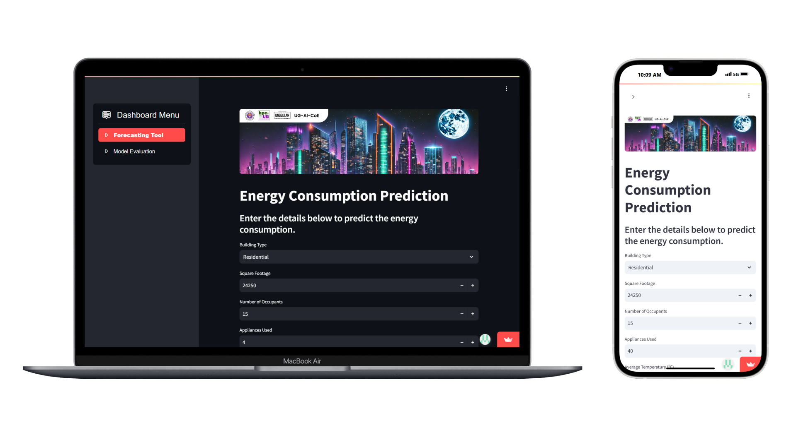

# ⚡ Analysis and Prediction of Energy Consumption in Buildings Using Ridge, Lasso, and Elastic Net Regression Algorithms.

## 🔎 About
This project focuses on the analysis and prediction of energy consumption in buildings using advanced regression techniques. By applying Ridge Regression, Lasso Regression, and Elastic Net Regression, it aims to identify key factors influencing energy usage and develop predictive models to improve efficiency and sustainability. This work was created for the Forum Group Discussion organized by Asisten MK Praktikum Unggulan DGX 2024/2025.

Project languages:
* id
* en

## ✨ Features
* Energy consumption prediction (kWh) based on building type, square footage, number of occupants, appliances used, average temperature, and day of week.
* Prediction model selector (Lasso, Ridge, and Elasticnet).
* Each model evaluation and comparison.
  
## 📦 Dependencies
|  Name  |  Version  |
|--------|-----------|
|[streamlit](https://pypi.org/project/streamlit/)|1.43.2|
|[streamlit-option-menu](https://pypi.org/project/streamlit-option-menu/)|0.4.0|
|[pandas](https://pypi.org/project/pandas/)|2.2.3|
|[matplotlib](https://pypi.org/project/matplotlib/)|3.10.1|
|[seaborn](https://pypi.org/project/seaborn/)|0.13.2|
|[requests](https://pypi.org/project/requests/)|2.32.3|
|[joblib](https://pypi.org/project/joblib/)|1.4.2|
|[numpy](https://pypi.org/project/numpy/)|2.2.4|
|[scikit-learn](https://pypi.org/project/scikit-learn/)|1.6.1|

## 🖥️ Requirements
* Operating System (OS): Windows 10, Mac, Linux.
* Web Browser: Google Chrome, Microsoft Edge, Firefox, Safari.

## 🥼 Author(s) / Contributor(s)
* Wicaksono Hanif Supriyanto
* Hans Naufal Granito
* Faizah Rizki Auliawati

## 📚 References
* GOVINDARAM SRIRAM. Energy Consumption Dataset - Linear Regression. Kaggle. https://www.kaggle.com/datasets/govindaramsriram/energy-consumption-dataset-linear-regression/data
* Shi, Y. (2023). Application of Improved linear regression algorithm in business behavior analysis. _Procedia Computer Science_, 228, 1101–1109. https://doi.org/10.1016/j.procs.2023.11.144
* Laoh, L. C. (2019). Dividend Payout Forecast: Multiple linear regression vs genetic algorithm-neural network. _Cogito Smart Journal_, 5(2), 252–265. https://doi.org/10.31154/cogito.v5i2.210.252-265
* Ryantika, H. A., Parida, M., Rustam, R., Afandi, H., Lubis, S. H., Uswandi, U., Afandi, A., & Nugroho, D. F. (2022). Linear regression method application to predict Cimory milk sales. _International Journal of Information System and Computer Science_ (IJISCS), 7(1), 1–7. https://jurnal.stmikpringsewu.ac.id/index.php/ijiscs/article/download/1333/pdf

